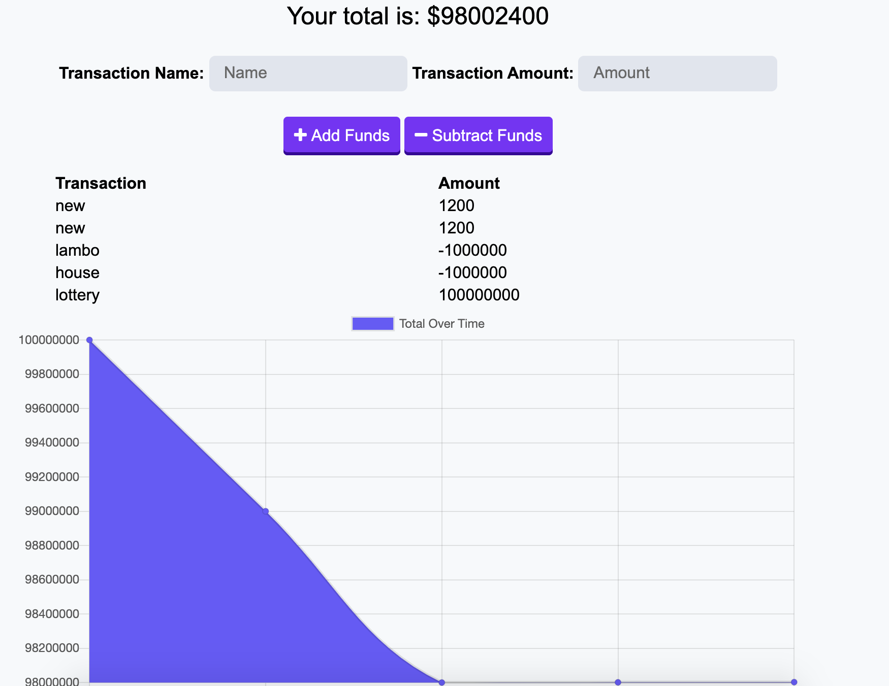

# Offline-Online-Budget-Tracker
This app is made to keep up with your spending habits.

## User Story

For someone who may travel a lot or is always on the go you are able to keep track of your withdrawals and deposits with or without a data/internet connection.

## Business Context

Giving users a fast and easy way to track their money is important, but allowing them to access that information anytime is even more important. Having offline functionality is paramount to our applications success.

## Links

https://personal-budget-tracker.herokuapp.com/
